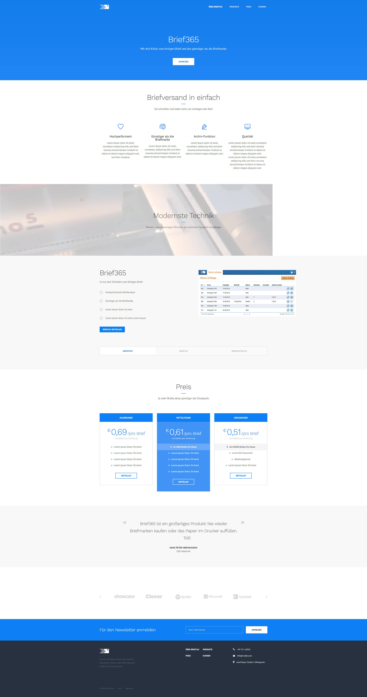

# design-brief365-demo
A design study created 2016 for a regiocom product

Thea idea was to have a fully enabled feature and pricing overview, links and descriptions to other products of the brand as well as to represent the "made in germany" quality the product and company stands for.

